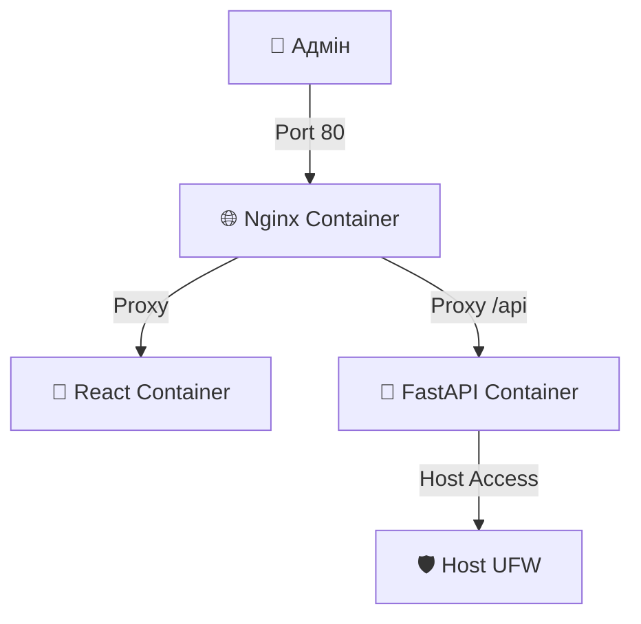

<p align="center">
  <a href="README_ENG.md">
    
  </a>
  <a href="README.md">
    
  </a>
</p>

<br>

# UFW-GUI v1.2.0 [](https://github.com/weby-homelab/ufw-gui/releases/latest) DOCKER Edition

<p align="center">
  
  
  
  
</p>

**Сучасна веб-панель керування фаєрволом UFW для Debian/Ubuntu.**

Ця гілка (`main`) призначена для швидкого розгортання через **Docker Compose**. Усі сервіси (Nginx, Backend, Frontend) упаковані в контейнери для максимальної ізоляції.

---

## 🚀 Основні можливості v1.2.0

- **🔒 Hardened Security:** Повна ізоляція API, динамічна генерація JWT-секретів та сувора валідація вхідних даних (Regex).
- **📈 Статистика атак:** Візуалізація заблокованого трафіку за останні 24 години.
- **🕒 Машина часу (Snapshots):** Автоматичне створення снапшотів конфігурації UFW перед кожною зміною.
- **🛡 Safe Reload:** Режим тестування (60 секунд) для запобігання втрати доступу.
- **🤖 Fail2Ban Integration:** Відображення активних банів SSH та можливість розбану.

---

## 🐳 Швидкий запуск (Docker)

### 1. Клонування
```bash
git clone https://github.com/weby-homelab/ufw-gui.git
cd ufw-gui
```

### 2. Конфігурація
Створіть файл `.env` з вашим секретним ключем:
```bash
echo "UFW_GUI_SECRET_KEY=$(openssl rand -hex 32)" > .env
```

### 3. Запуск
```bash
docker compose up -d --build
```

Панель буде доступна на порті **80** (або іншому, налаштованому в `docker-compose.yml`).

---

## 🏗 Архітектура (Docker)



## 📜 Ліцензія
Розповсюджується під ліцензією **MIT**.

<p align="center">
  ✦ 2026 Weby Homelab ✦<br>
  Made with ❤️ for Linux Security
</p>
