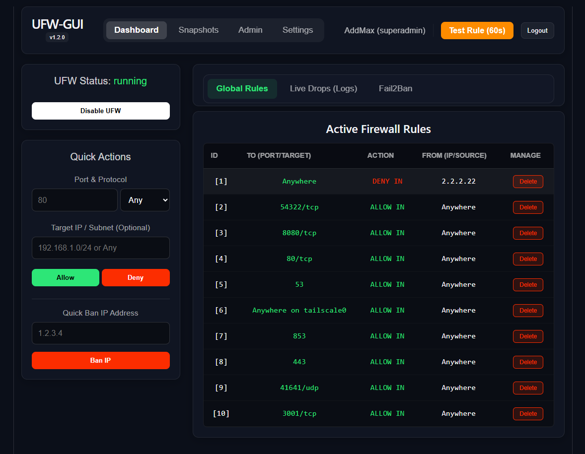
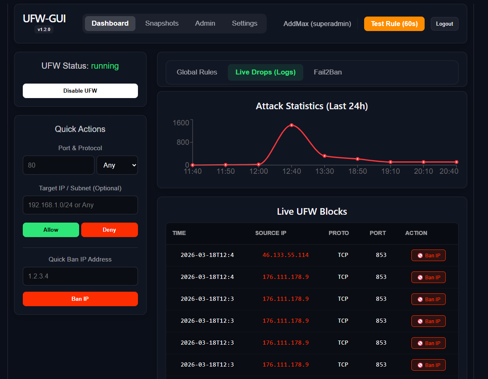
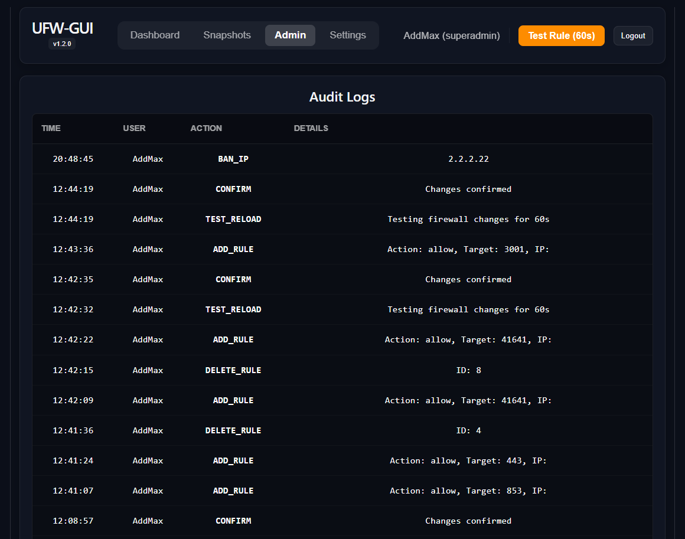

<p align="center">
  <a href="README_ENG.md">
    
  </a>
  <a href="README.md">
    
  </a>
</p>

<br>

<p align="center">
  
  
</p>

# UFW-GUI: Docker Edition

**UFW-GUI** — це сучасна, легка та безпечна веб-панель для управління фаєрволом UFW у дистрибутивах Debian та Ubuntu. Проект створений для системних адміністраторів, які цінують візуальний контроль, безпеку та швидкість налаштування.

Гілка `main` призначена для швидкого розгортання через **Docker Compose**. Усі сервіси (Nginx, Backend, Frontend) упаковані в контейнери для максимальної ізоляції.

---

## 🛡️ Безпека та Функціонал

Професійний підхід до управління мережевим захистом:

*   **Safe Reload:** Механізм захисту від самоблокування (60-секундний тестовий режим з авто-відкатом).
*   **Time Machine:** Система автоматичних снапшотів конфігурації перед кожною зміною.
*   **Attack Analytics:** Інтерактивні графіки заблокованого трафіку за останні 24 години.
*   **Fail2Ban Integration:** Візуалізація та управління активними банами SSH (перегляд та розбан в один клік).
*   **Smart Alerts:** Миттєві Telegram-сповіщення про будь-які зміни в правилах або дії адміністраторів.
*   **Audit Trail:** Повна історія дій користувачів у вбудованому журналі аудиту.

---

## 🐳 Швидкий запуск (Docker)

### 1. Клонування репозиторію
```bash
git clone https://github.com/weby-homelab/ufw-gui.git
cd ufw-gui
```

### 2. Налаштування середовища
Згенеруйте унікальний секретний ключ для JWT-авторизації:
```bash
echo "UFW_GUI_SECRET_KEY=$(openssl rand -hex 32)" > .env
```

### 3. Запуск сервісів
```bash
docker compose up -d --build
```

Панель буде доступна за адресою вашого сервера на порті **80**. При першому вході система автоматично запропонує створити обліковий запис суперадміна.

---

## 📸 Скріншоти інтерфейсу

<p align="center">
  
  
  
</p>

---

## 📸 Скріншоти інтерфейсу

<p align="center">
  
  
  
</p>

---

## 🏗️ Архітектура рішення

Проект розділений на три ізольовані рівні:

1.  **Frontend (React):** Швидкий та адаптивний SPA-інтерфейс.
2.  **Backend (FastAPI):** Асинхронний API з високим рівнем захисту та валідації.
3.  **Reverse Proxy (Nginx):** Забезпечує безпечне проксіювання та роздачу статичних файлів.

---

## 📜 Гілки та версії

*   `main` — **Docker Edition**. Рекомендовано для серверів з Docker-інфраструктурою.
*   `classic` — **Bare Metal**. Пряме розгортання в ОС через Systemd (без контейнерів).

---

## 🤝 Підтримка та Розробка

<p align="center">
  
  
</p>

Розроблено з ❤️ командою **Weby Homelab** для спільноти Linux.
