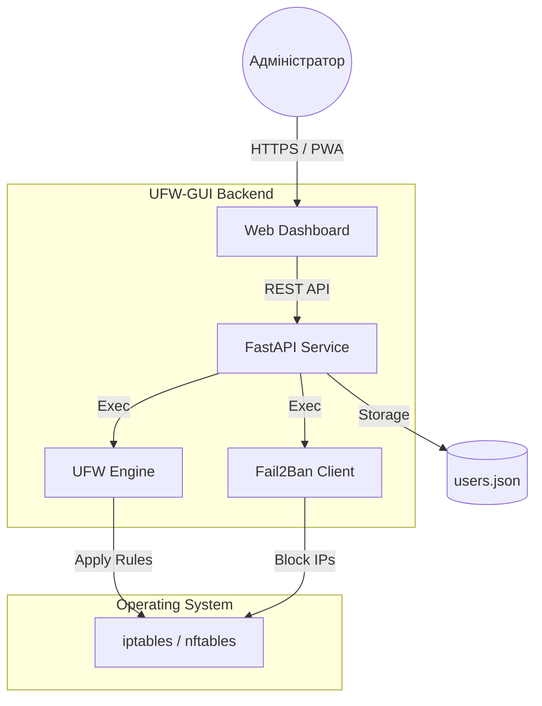

<p align="center">
  <a href="README_ENG.md">
    
  </a>
  <a href="README.md">
    
  </a>
</p>

<br>

# 🛡️ UFW-GUI (Weby Homelab)
*Легке, швидке та мінімалістичне керування UFW.*

[](https://github.com/weby-homelab/ufw-gui/releases/latest)
[](LICENSE)
[]()

**UFW-GUI** — це мінімалістична веб-панель для керування `UFW` (Uncomplicated Firewall) та `Fail2Ban`. Вона створена для проєктів, де не потрібні складні зони Firewalld, а важлива швидкість налаштування та наочність правил. Ідеальний вибір для персональних серверів та легких VPS.

---

## 🧩 Архітектура системи



---

## ✨ Основні можливості

- **⚡ Мобільний інтерфейс:** Керуйте безпекою сервера прямо зі смартфона. Адаптивний дизайн дозволяє швидко відкрити або закрити порт "на ходу".
- **🧱 Спрощене керування правилами:** Додавайте та видаляйте дозволи за лічені секунди. Жодних складних конфігураційних файлів.
- **🚫 Fail2Ban Monitoring:** Переглядайте список заблокованих IP та розбанюйте їх в один клік.
- **🔒 Безпека понад усе:** Вбудований захист від Brute Force для самої панелі та авторизація через JWT.
- **🐳 Docker Ready:** Повна підтримка розгортання через Docker для ізоляції оточення.

---

## 🛠️ Швидкий старт

### Через Docker Compose
```yaml
services:
  ufw-gui:
    image: webyhomelab/ufw-gui:latest
    container_name: ufw-gui
    privileged: true
    network_mode: host
    restart: unless-stopped
    env_file: .env
```
*Важливо: `privileged: true` та `network_mode: host` обов'язкові для роботи з UFW хостової системи.*

---

## 📋 Системні вимоги
- **ОС:** Debian 11/12, Ubuntu 20.04/22.04/24.04.
- **Залежності:** `ufw`, `fail2ban` (опціонально).
- **Доступ:** Права `root`.

---
<p align="center">
  Made with ❤️ in Kyiv under air raid sirens and blackouts<br>
  <strong>✦ 2026 Weby Homelab ✦</strong>
</p>
