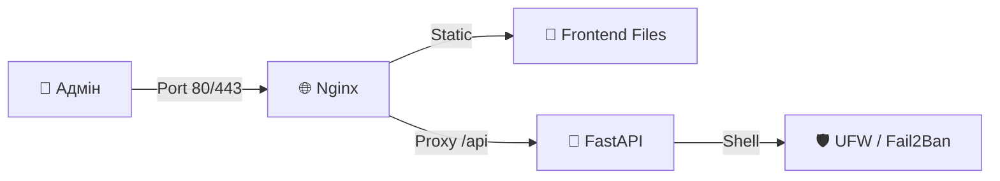

<p align="center">
  <a href="README_ENG.md">
    
  </a>
  <a href="README.md">
    
  </a>
</p>

<br>

# UFW-GUI v1.2.0 [](https://github.com/weby-homelab/ufw-gui/releases/latest) BARE METAL Edition

<p align="center">
  
  
  
  
</p>

**Сучасна веб-панель керування фаєрволом UFW для Debian/Ubuntu.**

Ця гілка (`classic`) призначена для розгортання безпосередньо в операційній системі як набір системних сервісів (Systemd) під управлінням Nginx.

---

## 🚀 Основні можливості v1.2.0

- **🔒 Hardened Security:** Повна ізоляція API (слухає лише `127.0.0.1`), динамічна генерація JWT-секретів та сувора валідація вхідних даних (Regex) для запобігання ін'єкціям.
- **📈 Статистика атак:** Візуалізація заблокованого трафіку за останні 24 години безпосередньо на дашборді.
- **🕒 Машина часу (Snapshots):** Автоматичне створення снапшотів конфігурації UFW перед кожною зміною — ви завжди можете відкотитись назад.
- **🛡 Safe Reload:** Режим тестування (60 секунд), який автоматично повертає старі правила, якщо ви втратили доступ до сервера.
- **🤖 Fail2Ban Integration:** Відображення активних банів SSH та можливість миттєвого розбану через веб-інтерфейс.

---

## 🛠 Встановлення (Bare Metal)

### 1. Підготовка системи
```bash
sudo apt update && sudo apt install -y python3-venv python3-pip nodejs npm nginx ufw git
```

### 2. Клонування та Бекенд
```bash
git clone -b classic https://github.com/weby-homelab/ufw-gui.git
cd ufw-gui/backend
python3 -m venv venv
./venv/bin/pip install -r requirements.txt
```

### 3. Збирання Фронтенду
```bash
cd ../frontend
npm install
npm run build
# Копіюємо у веб-директорію
sudo mkdir -p /var/www/html/ufw-gui
sudo cp -r dist/* /var/www/html/ufw-gui/
sudo chown -R www-data:www-data /var/www/html/ufw-gui/
```

### 4. Налаштування сервісу
Створіть файл `/etc/systemd/system/ufw-gui-backend.service`:
```ini
[Unit]
Description=UFW-GUI Backend
After=network.target

[Service]
User=root
WorkingDirectory=/path/to/ufw-gui/backend
Environment="UFW_GUI_SECRET_KEY=$(openssl rand -hex 32)"
ExecStart=/path/to/ufw-gui/backend/venv/bin/uvicorn main:app --host 127.0.0.1 --port 8000
Restart=always

[Install]
WantedBy=multi-user.target
```

### 5. Конфігурація Nginx
Налаштуйте проксіювання на порт 8000 для API та роздачу статичних файлів для `/`.

---

## 🏗 Архітектура (Classic)



## 📜 Ліцензія
Розповсюджується під ліцензією **MIT**.

<p align="center">
  ✦ 2026 Weby Homelab ✦<br>
  Made with ❤️ for Linux Security
</p>
