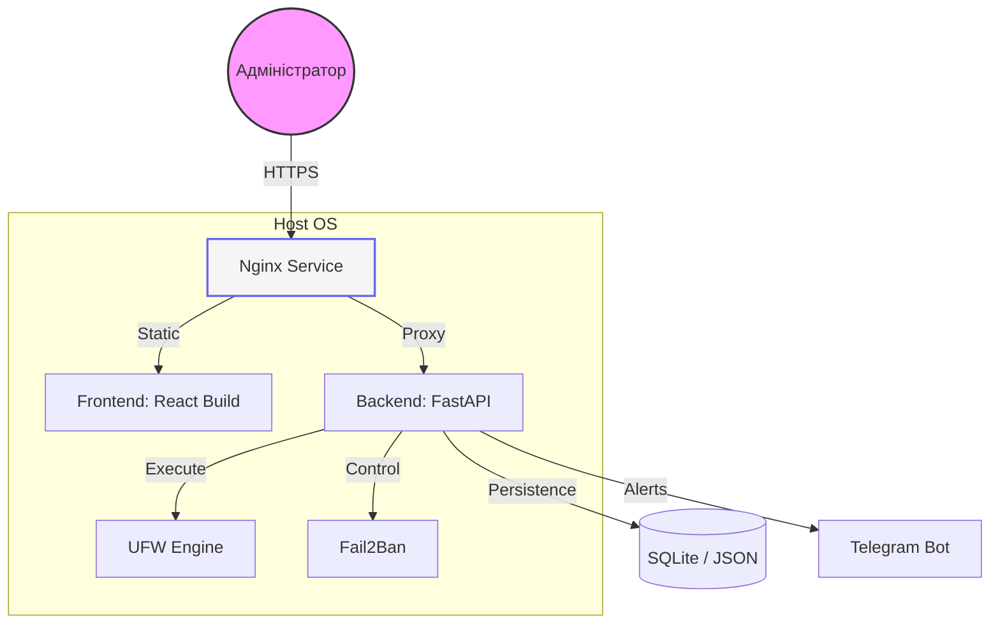

<p align="center">
  <a href="README_ENG.md">
    
  </a>
  <a href="README.md">
    
  </a>
</p>

<br>

<h1 align="center">🛡️ UFW-GUI (Bare Metal Edition)</h1>

<p align="center">
  <a href="https://github.com/weby-homelab/ufw-gui/releases/latest"></a>
  
  
</p>

<p align="center">
  <strong>Сучасне, швидке та естетичне керування мережевою безпекою Linux безпосередньо на вашому хості.</strong>
</p>

## ✨ Огляд

**UFW-GUI** — це професійна веб-панель для керування `UFW` та `Fail2Ban`. Вона перетворює складні консольні команди на інтуїтивно зрозумілий дашборд із аналітикою в реальному часі. Ідеально підходить для серверів, де використання Docker є небажаним або неможливим.

### 📸 Інтерфейс додатку

<p align="center">
  
  <br>
  <em>Аналітика та статус системи безпеки</em>
</p>

<p align="center">
  
  <br>
  <em>Інтуїтивне управління правилами та Fail2Ban</em>
</p>

## 🚀 Основні можливості

### 🛠 Керування правилами
- **Quick Rules:** Швидке додавання дозволів або заборон для портів та IP.
- **Rule Management:** Перегляд та видалення активних правил через браузер.
- **Test Mode:** Безпечне тестування правил на 60 секунд з автоматичним відкатом.

### 🔍 Threat Intelligence & Аналітика
- **Live Drops:** Відстежуйте відхилені пакети у реальному часі.
- **Visual Analytics:** Графіки активності атак за останні 24 години.
- **Fail2Ban Control:** Повний контроль над активними банами та статусом джейлів.

### 🛡 Безпека та Надійність
- **Auto-Snapshots:** Система автоматично робить бекап перед кожною зміною.
- **Audit Logs:** Детальний журнал дій для командної роботи.
- **Telegram Alerts:** Миттєві сповіщення про зміну правил у ваш Telegram.

---

## 🏗️ Архітектура системи


```mermaid
graph TD
    User((Адміністратор)) -->|HTTPS| Nginx[Nginx Service]
    Nginx -->|Static| UI[Frontend: React Build]
    Nginx -->|Proxy| API[Backend: FastAPI]
    
    subgraph "Host OS"
        Nginx
        UI
        API
        UFW[UFW Engine]
        F2B[Fail2Ban]
    end
    
    API -->|Execute| UFW
    API -->|Control| F2B
    API -->|Persistence| DB[(SQLite / JSON)]
    API -->|Alerts| TG[Telegram Bot]

    style User fill:#f9f,stroke:#333,stroke-width:2px
    style Nginx fill:#f5f5f5,stroke:#6366f1,stroke-width:2px
```

---

## 📦 Встановлення (Коротко)

Встановлення Bare Metal версії вимагає наявності **Python 3**, **Node.js**, та **Nginx**.

1.  **Клонуйте репозиторій:**
    ```bash
    git clone -b classic https://github.com/weby-homelab/ufw-gui.git /opt/ufw-gui
    ```

2.  **Налаштуйте бекенд:**
    ```bash
    cd /opt/ufw-gui/backend
    pip3 install -r requirements.txt
    ```

3.  **Зберіть фронтенд:**
    ```bash
    cd /opt/ufw-gui/frontend
    npm install && npm run build
    ```

4.  **Налаштуйте сервіси:**
    Використовуйте `systemd` для запуску бекенду та `nginx` для роздачі статики.

---

## 📋 Системні вимоги
- **ОС:** Ubuntu 22.04/24.04, Debian 11/12, AlmaLinux 9.
- **Залежності:** `python3`, `nodejs`, `nginx`, `ufw`, `fail2ban`.
- **Доступ:** Права `root` (або `sudo`) для керування системними службами.

---

<br>
<p align="center">
  Built in Ukraine under air raid sirens &amp; blackouts ⚡<br>
  &copy; 2026 Weby Homelab
</p>
