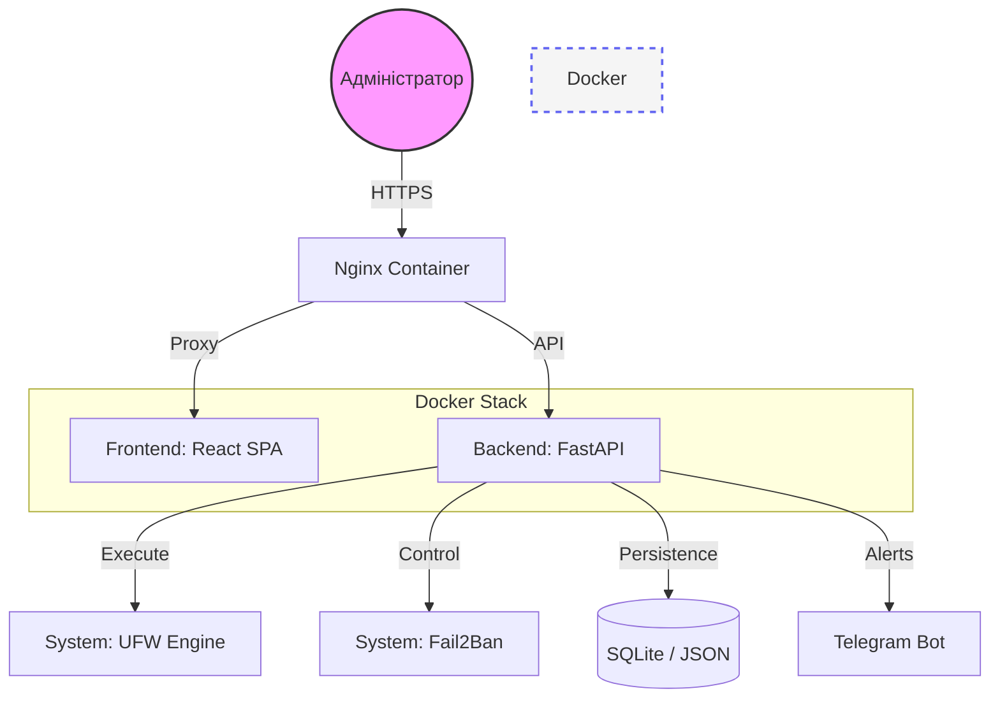

<p align="center">
  <a href="README.md">
    
  </a>
  <a href="README.ua.md">
    
  </a>
</p>

<br>

# 🛡️ UFW-GUI (Docker Edition)
*Сучасне, безпечне та естетичне керування мережевою безпекою Linux через Docker.*

[](https://github.com/weby-homelab/ufw-gui/releases/latest)
[](LICENSE)
[](https://hub.docker.com/r/webyhomelab/ufw-gui)

**UFW-GUI** — це потужний веб-інтерфейс для керування системним брандмауером `UFW` та системою `Fail2Ban`. Проєкт створений для тих, хто цінує візуальний контроль та зручність, не втрачаючи при цьому в безпеці.

---

<p align="center">
  
  <br><br>
  
</p>

---

## 🚀 Основні можливості

### 🛠 Керування правилами
- **Quick Rules:** Швидке додавання дозволів або заборон для портів та IP.
- **Rule Management:** Перегляд та видалення активних правил в один клік.
- **Test Mode:** Безпечне тестування правил на 60 секунд з автоматичним відкатом при втраті зв'язку.

### 🔍 Аналітика та Моніторинг
- **Live Drops:** Моніторинг відхилених пакетів у реальному часі.
- **Attack Stats:** Графіки активності атак за останні 24 години (Recharts).
- **Fail2Ban Integration:** Перегляд заблокованих IP та розбан в один клік.

### 🛡 Безпека та Надійність
- **Time Machine:** Автоматичне створення знімків конфігурації (Snapshots).
- **Audit Logs:** Детальний журнал дій користувачів.
- **Telegram Alerts:** Миттєві сповіщення про зміну правил у ваш Telegram.

---

## 🏗️ Архітектура системи



---

## 📦 Встановлення (Docker Compose)

Найпростіший спосіб запустити **UFW-GUI** — використовувати `docker-compose.yml`:

1.  **Клонуйте репозиторій:**
    ```bash
    git clone https://github.com/weby-homelab/ufw-gui.git
    cd ufw-gui
    ```

2.  **Налаштуйте середовище:**
    Створіть файл `.env` на основі `backend/.env.example` та встановіть `UFW_GUI_SECRET_KEY`.

3.  **Запустіть контейнери:**
    ```bash
    docker compose up -d
    ```

Панель буде доступна на порті **8080** (або налаштованому у вашому Reverse Proxy).

---

## 📋 Системні вимоги
- **ОС:** Ubuntu 22.04+, Debian 11+, AlmaLinux 9+.
- **Залежності:** `docker`, `docker-compose`, `ufw`, `fail2ban`.
- **Доступ:** Права `root` (NET_ADMIN та SYS_ADMIN capabilities) для контейнера бекенду.

### ⚠️ Особливості інтеграції Docker та хост-системи (Обов'язково до прочитання)
- **Активність служб на хості:** Служби `UFW` та `Fail2Ban` **повинні бути встановлені та активні на хості (Host OS)**, а не всередині контейнера.
- **Принцип роботи:** Контейнер використовує `network_mode: host` для прямого доступу до мережевого стеку хоста. Бекенд виконує утиліту `ufw` у просторі контейнера, керуючи конфігурацією фаєрволу хоста через примонтовану папку `/etc/ufw`.
- **Моніторинг логів:** Статистика відхилених пакетів та атаки зчитуються шляхом монтування `/var/log` хоста у режимі тільки для читання (read-only). Контейнер парсить хостові файли `/var/log/ufw.log` та `/var/log/fail2ban.log`.
- **Керування Fail2Ban:** Взаємодія з демоном Fail2Ban хоста відбувається через примонтований сокет `/var/run/fail2ban/fail2ban.sock`.

---
<br>
<p align="center">
  Built in Ukraine under air raid sirens &amp; blackouts ⚡<br>
  &copy; 2026 Weby Homelab
</p>
