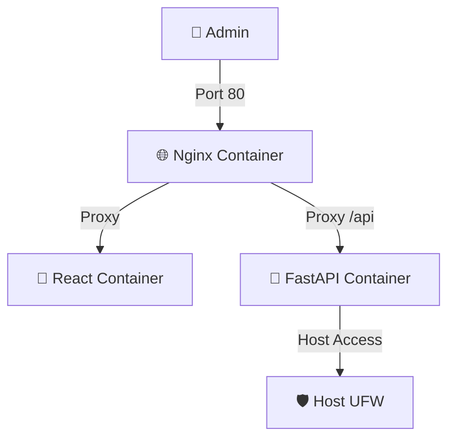

<p align="center">
  <a href="README_ENG.md">
    
  </a>
  <a href="README.md">
    
  </a>
</p>

<br>

# UFW-GUI v1.2.0 [](https://github.com/weby-homelab/ufw-gui/releases/latest) DOCKER Edition

<p align="center">
  
  
  
  
</p>

**A modern web interface for managing the UFW firewall on Debian/Ubuntu systems.**

This branch (`main`) is designed for quick deployment via **Docker Compose**. All services (Nginx, Backend, Frontend) are containerized for maximum isolation.

---

## 🚀 Key Features v1.2.0

- **🔒 Hardened Security:** Complete API isolation, dynamic JWT secret generation, and strict input validation (Regex).
- **📈 Attack Statistics:** Visualized charts of blocked requests from the last 24 hours.
- **🕒 Time Machine (Snapshots):** Automatic UFW configuration snapshots before every change.
- **🛡 Safe Reload:** Testing mode (60 seconds) to prevent losing connection to your server.
- **🤖 Fail2Ban Integration:** View active SSH bans and instantly unban IPs.

---

## 🐳 Quick Start (Docker)

### 1. Cloning
```bash
git clone https://github.com/weby-homelab/ufw-gui.git
cd ufw-gui
```

### 2. Configuration
Create a `.env` file with your secure key:
```bash
echo "UFW_GUI_SECRET_KEY=$(openssl rand -hex 32)" > .env
```

### 3. Launch
```bash
docker compose up -d --build
```

The panel will be available on port **80** (or as configured in `docker-compose.yml`).

---

## 🏗 Architecture (Docker)



## 📜 License
Distributed under the **MIT** License.

<p align="center">
  ✦ 2026 Weby Homelab ✦<br>
  Made with ❤️ for Linux Security
</p>
