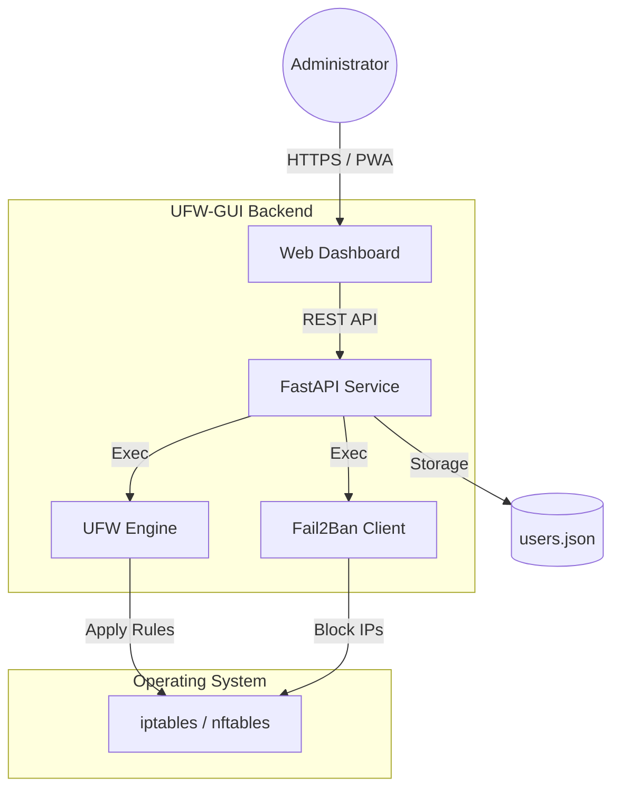

<p align="center">
  <a href="README_ENG.md">
    
  </a>
  <a href="README.md">
    
  </a>
</p>

<br>

# 🛡️ UFW-GUI (Weby Homelab)
*Lightweight, Fast, and Minimalistic UFW Management.*

[](https://github.com/weby-homelab/ufw-gui/releases/latest)
[](LICENSE)
[]()

**UFW-GUI** is a minimalistic web dashboard for managing `UFW` (Uncomplicated Firewall) and `Fail2Ban`. It's designed for projects where complex Firewalld zones aren't needed, but configuration speed and rule visibility are paramount. The perfect choice for personal servers and lightweight VPS.

---

## 🧩 System Architecture



---

## ✨ Key Features

- **⚡ Mobile Interface:** Manage server security directly from your smartphone. Responsive design allows you to quickly open or close a port "on the go."
- **🧱 Simplified Rule Management:** Add and remove permissions in seconds. No complex configuration files.
- **🚫 Fail2Ban Monitoring:** View the list of blocked IPs and unban them in one click.
- **🔒 Security First:** Built-in Brute Force protection for the dashboard itself and JWT-based authorization.
- **🐳 Docker Ready:** Full support for Docker deployment to isolate the environment.

---

## 🛠️ Quick Start

### Via Docker Compose
```yaml
services:
  ufw-gui:
    image: webyhomelab/ufw-gui:latest
    container_name: ufw-gui
    privileged: true
    network_mode: host
    restart: unless-stopped
    env_file: .env
```
*Note: `privileged: true` and `network_mode: host` are mandatory for interacting with the host system's UFW.*

---

## 📋 System Requirements
- **OS:** Debian 11/12, Ubuntu 20.04/22.04/24.04.
- **Dependencies:** `ufw`, `fail2ban` (optional).
- **Access:** `root` privileges.

---
<p align="center">
  Made with ❤️ in Kyiv under air raid sirens and blackouts<br>
  <strong>✦ 2026 Weby Homelab ✦</strong>
</p>
