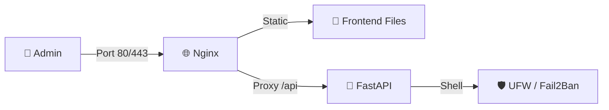

<p align="center">
  <a href="README_ENG.md">
    
  </a>
  <a href="README.md">
    
  </a>
</p>

<br>

# UFW-GUI v1.2.0 — LIGHT⚡️ SAFETY [](https://github.com/weby-homelab/ufw-gui/releases/latest) BARE METAL Edition

<p align="center">
  
  
  
  
</p>

**A modern web interface for managing the UFW firewall on Debian/Ubuntu systems.**

This branch (`classic`) is designed for deployment directly in the operating system as a set of system services (Systemd) served by Nginx.

---

## 🚀 Key Features v1.2.0

- **🔒 Hardened Security:** Complete API isolation (listening only on `127.0.0.1`), dynamic JWT secret generation, and strict input validation (Regex) to prevent command injection.
- **📈 Attack Statistics:** Visualize blocked traffic from the last 24 hours directly on the main dashboard.
- **🕒 Time Machine (Snapshots):** Automatic UFW configuration snapshots before every change — you can always roll back.
- **🛡 Safe Reload:** Testing mode (60 seconds) that automatically reverts rules if you lose connection to your server.
- **🤖 Fail2Ban Integration:** View active SSH bans and instantly unban IPs via the web interface.

---

## 🛠 Installation (Bare Metal)

### 1. System Preparation
```bash
sudo apt update && sudo apt install -y python3-venv python3-pip nodejs npm nginx ufw git
```

### 2. Cloning and Backend
```bash
git clone -b classic https://github.com/weby-homelab/ufw-gui.git
cd ufw-gui/backend
python3 -m venv venv
./venv/bin/pip install -r requirements.txt
```

### 3. Frontend Build
```bash
cd ../frontend
npm install
npm run build
# Copy to web directory
sudo mkdir -p /var/www/html/ufw-gui
sudo cp -r dist/* /var/www/html/ufw-gui/
sudo chown -R www-data:www-data /var/www/html/ufw-gui/
```

### 4. Service Setup
Create the file `/etc/systemd/system/ufw-gui-backend.service`:
```ini
[Unit]
Description=UFW-GUI Backend
After=network.target

[Service]
User=root
WorkingDirectory=/path/to/ufw-gui/backend
Environment="UFW_GUI_SECRET_KEY=$(openssl rand -hex 32)"
ExecStart=/path/to/ufw-gui/backend/venv/bin/uvicorn main:app --host 127.0.0.1 --port 8000
Restart=always

[Install]
WantedBy=multi-user.target
```

### 5. Nginx Configuration
Configure a reverse proxy to port 8000 for the API and serve static files for `/`.

---

## 🏗 Architecture (Classic)



## 📜 License
Distributed under the **MIT** License.

<p align="center">
  ✦ 2026 Weby Homelab ✦<br>
  Made with ❤️ for Linux Security
</p>
