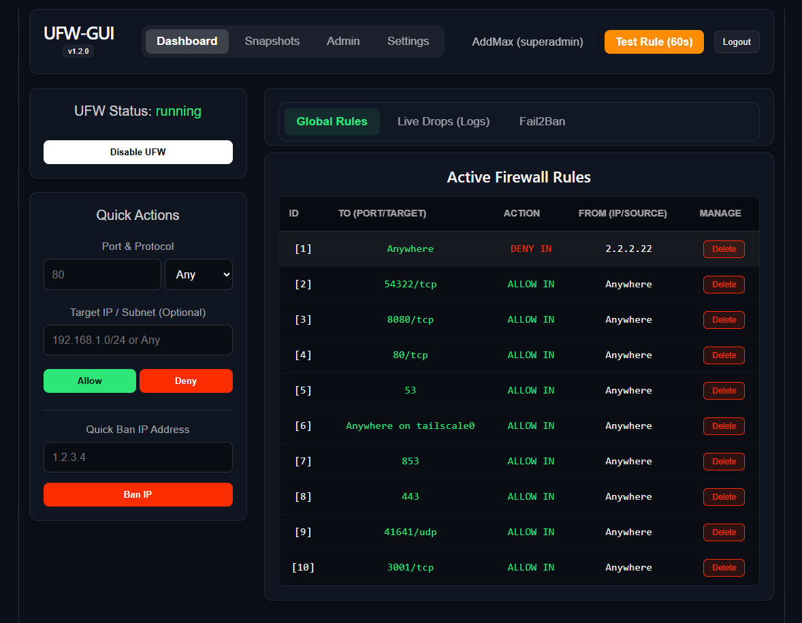
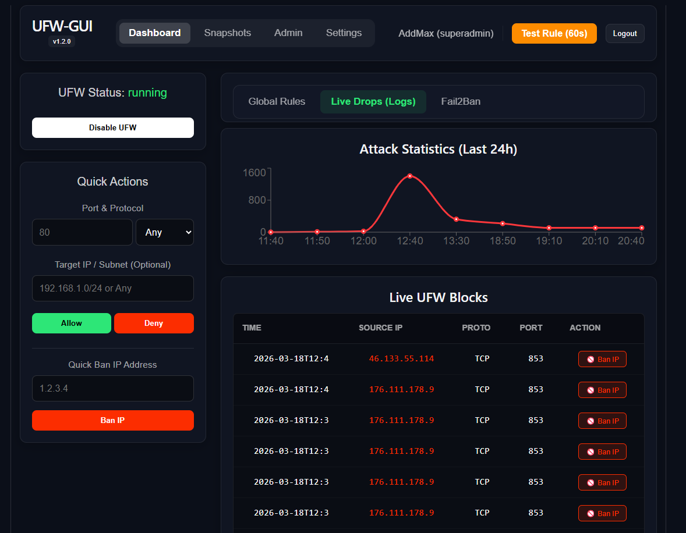

<p align="center">
  <a href="README_ENG.md">
    
  </a>
  <a href="README.md">
    
  </a>
</p>

<br>

<h1 align="center">🛡️ UFW-GUI v1.4.0 — NETWORK SECURITY (Docker Edition)</h1>

<p align="center">
  <a href="https://github.com/weby-homelab/ufw-gui/releases/latest"></a>
  <a href="https://hub.docker.com/r/webyhomelab/ufw-gui-backend"></a>
</p>

<p align="center">
  <strong>A modern, secure web interface for managing the Uncomplicated Firewall (UFW) via Docker.</strong>
</p>

## ✨ Overview

**UFW-GUI** is an elegant and secure solution for monitoring and managing firewall rules on your servers. With its modern design and thoughtful functionality, network security control has never been easier.

### 📸 App Interface

<p align="center">
  
  <br>
  <em>Dashboard and System Status</em>
</p>

<p align="center">
  
  <br>
  <em>Easy Rule Management and Profiles</em>
</p>

## 🚀 Key Features

- **💡 Modern UI/UX:** Intuitive interface.
- **📊 Status Visualization:** Instant overview of UFW state and active connections.
- **🛡️ Easy Rule Management:** Add, delete, and edit rules in one click.
- **🔒 Hardened Security:** Secret key protection, strict CORS, and input sanitization.
- **🐳 Docker Edition:** Fast and isolated deployment via containers.

## 🛡️ Security Hardening (v1.4.0)
- **Zero-Fallback Secrets:** App requires a defined `UFW_GUI_SECRET_KEY` to start.
- **Strict CORS:** Enforced origin restriction via `ALLOWED_ORIGINS`.
- **Input Sanitization:** Robust validation of IP, ports, and protocols.

## 📦 Docker Installation (Main Mode)

1. **Clone & Setup:**
   ```bash
   git clone https://github.com/weby-homelab/ufw-gui.git
   cd ufw-gui
   cp backend/.env.example backend/.env
   ```

2. **Generate Secret:** `openssl rand -hex 32`

3. **Configure `.env`:** Insert your generated key and allowed domains.

4. **Deploy:** `docker compose up -d`

---

<br>
<p align="center">
  Built in Ukraine under air raid sirens &amp; blackouts ⚡<br>
  &copy; 2026 Weby Homelab
</p>
