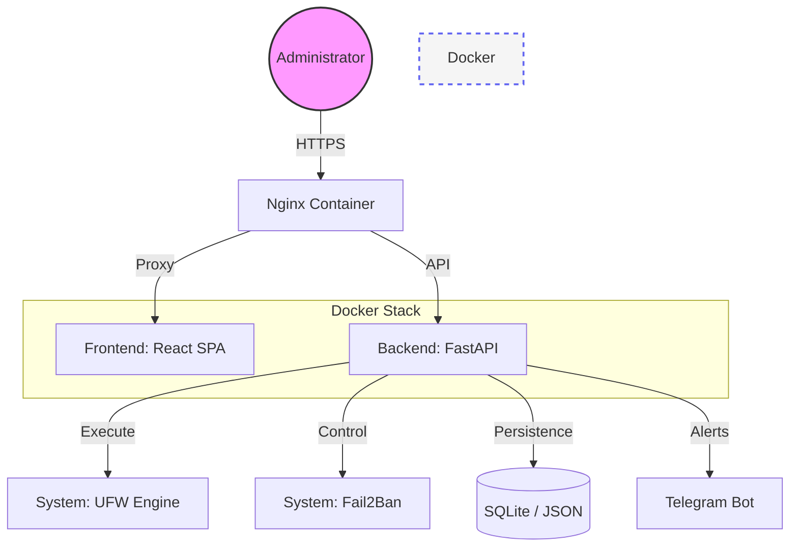

<p align="center">
  <a href="README_ENG.md">
    
  </a>
  <a href="README.md">
    
  </a>
</p>

<br>

# 🛡️ UFW-GUI (Docker Edition)
*Modern, secure, and aesthetic network security management for Linux via Docker.*

[](https://github.com/weby-homelab/ufw-gui/releases/latest)
[](LICENSE)
[](https://hub.docker.com/r/webyhomelab/ufw-gui-backend)

**UFW-GUI** is a powerful web interface for managing the `UFW` system firewall and `Fail2Ban`. The project is designed for those who value visual control and convenience without compromising on security.

---

<p align="center">
  
  <br><br>
  
</p>

---

## 🚀 Key Features

### 🛠 Rule Management
- **Quick Rules:** Fast addition of allows or denies for ports and IPs.
- **Rule Management:** View and delete active rules in one click.
- **Test Mode:** Safely test rules for 60 seconds with automatic rollback if connection is lost.

### 🔍 Analytics & Monitoring
- **Live Drops:** Real-time monitoring of rejected packets.
- **Attack Stats:** Attack activity graphs for the last 24 hours (Recharts).
- **Fail2Ban Integration:** View blocked IPs and unban in one click.

### 🛡 Security & Reliability
- **Time Machine:** Automatic configuration snapshots.
- **Audit Logs:** Detailed user action logs.
- **Telegram Alerts:** Instant notifications of rule changes directly to your Telegram.

---

## 🏗️ System Architecture


```mermaid
graph TD
    User((Administrator)) -->|HTTPS| Nginx[Nginx Container]
    Nginx -->|Proxy| UI[Frontend: React SPA]
    Nginx -->|API| API[Backend: FastAPI]
    
    subgraph "Docker Stack"
        UI
        API
    end
    
    API -->|Execute| UFW[System: UFW Engine]
    API -->|Control| F2B[System: Fail2Ban]
    API -->|Persistence| DB[(SQLite / JSON)]
    API -->|Alerts| TG[Telegram Bot]

    style User fill:#f9f,stroke:#333,stroke-width:2px
    style Docker fill:#f5f5f5,stroke:#6366f1,stroke-width:2px,stroke-dasharray: 5 5
```

---

## 📦 Installation (Docker Compose)

The easiest way to run **UFW-GUI** is using `docker-compose.yml`:

1.  **Clone the repository:**
    ```bash
    git clone https://github.com/weby-homelab/ufw-gui.git
    cd ufw-gui
    ```

2.  **Configure Environment:**
    Create a `.env` file based on `backend/.env.example` and set `UFW_GUI_SECRET_KEY`.

3.  **Start Containers:**
    ```bash
    docker compose up -d
    ```

The dashboard will be available on port **80** (or as configured in your Nginx).

---

## 📋 System Requirements
- **OS:** Ubuntu 22.04+, Debian 11+, AlmaLinux 9+.
- **Dependencies:** `docker`, `docker-compose`, `ufw`, `fail2ban`.
- **Access:** `root` privileges (privileged mode) for the backend container.

---
<br>
<p align="center">
  Built in Ukraine under air raid sirens &amp; blackouts ⚡<br>
  &copy; 2026 Weby Homelab
</p>
