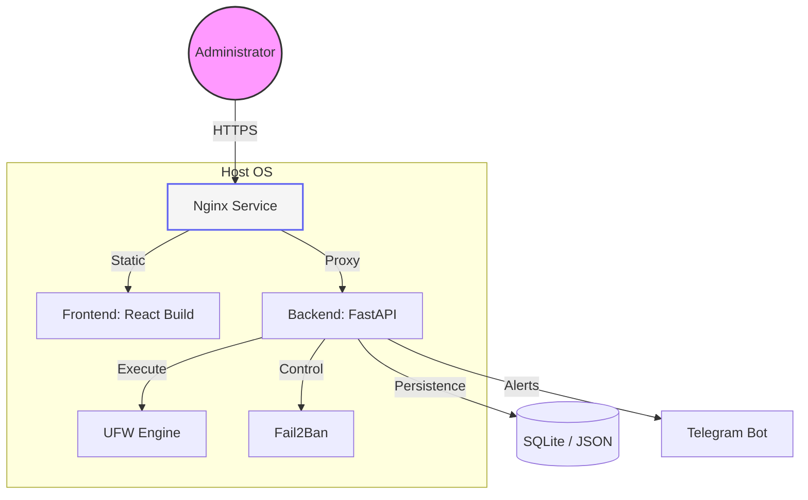

<p align="center">
  <a href="README_ENG.md">
    
  </a>
  <a href="README.md">
    
  </a>
</p>

<br>

# 🛡️ UFW-GUI (Bare Metal Edition)
*Modern, fast, and aesthetic network security management directly on your host.*

[](https://github.com/weby-homelab/ufw-gui/releases/latest)
[](LICENSE)
[]()

**UFW-GUI** is a professional web panel for managing `UFW` and `Fail2Ban`. It transforms complex console commands into an intuitive dashboard with real-time analytics. Perfect for servers where Docker is restricted or unnecessary.

---

<p align="center">
  
  <br><br>
  
</p>

---

## 🚀 Key Features

### 🛠 Rule Management
- **Quick Rules:** Fast addition of allows or denies for ports and IPs.
- **Rule Management:** View and delete active rules via the browser.
- **Test Mode:** Safely test rules for 60 seconds with automatic rollback.

### 🔍 Threat Intelligence & Analytics
- **Live Drops:** Track rejected packets in real-time.
- **Visual Analytics:** Attack activity graphs for the last 24 hours.
- **Fail2Ban Control:** Full control over active bans and jail status.

### 🛡 Security & Reliability
- **Auto-Snapshots:** Automatically backs up the configuration before every change.
- **Audit Logs:** Detailed action logs for team collaboration.
- **Telegram Alerts:** Instant notifications of rule changes directly to your Telegram.

---

## 🏗️ System Architecture


```mermaid
graph TD
    User((Administrator)) -->|HTTPS| Nginx[Nginx Service]
    Nginx -->|Static| UI[Frontend: React Build]
    Nginx -->|Proxy| API[Backend: FastAPI]
    
    subgraph "Host OS"
        Nginx
        UI
        API
        UFW[UFW Engine]
        F2B[Fail2Ban]
    end
    
    API -->|Execute| UFW
    API -->|Control| F2B
    API -->|Persistence| DB[(SQLite / JSON)]
    API -->|Alerts| TG[Telegram Bot]

    style User fill:#f9f,stroke:#333,stroke-width:2px
    style Nginx fill:#f5f5f5,stroke:#6366f1,stroke-width:2px
```

---

## 📦 Installation (Brief)

Bare Metal installation requires **Python 3**, **Node.js**, and **Nginx**.

1.  **Clone the repository:**
    ```bash
    git clone -b classic https://github.com/weby-homelab/ufw-gui.git /opt/ufw-gui
    ```

2.  **Setup Backend:**
    ```bash
    cd /opt/ufw-gui/backend
    pip3 install -r requirements.txt
    ```

3.  **Build Frontend:**
    ```bash
    cd /opt/ufw-gui/frontend
    npm install && npm run build
    ```

4.  **Configure Services:**
    Use `systemd` to run the backend and `nginx` to serve the static frontend.

---

## 📋 System Requirements
- **OS:** Ubuntu 22.04/24.04, Debian 11/12, AlmaLinux 9.
- **Dependencies:** `python3`, `nodejs`, `nginx`, `ufw`, `fail2ban`.
- **Permissions:** `root` (or `sudo`) access to manage system services.

---
<br>
<p align="center">
  Built in Ukraine under air raid sirens &amp; blackouts ⚡<br>
  &copy; 2026 Weby Homelab
</p>
